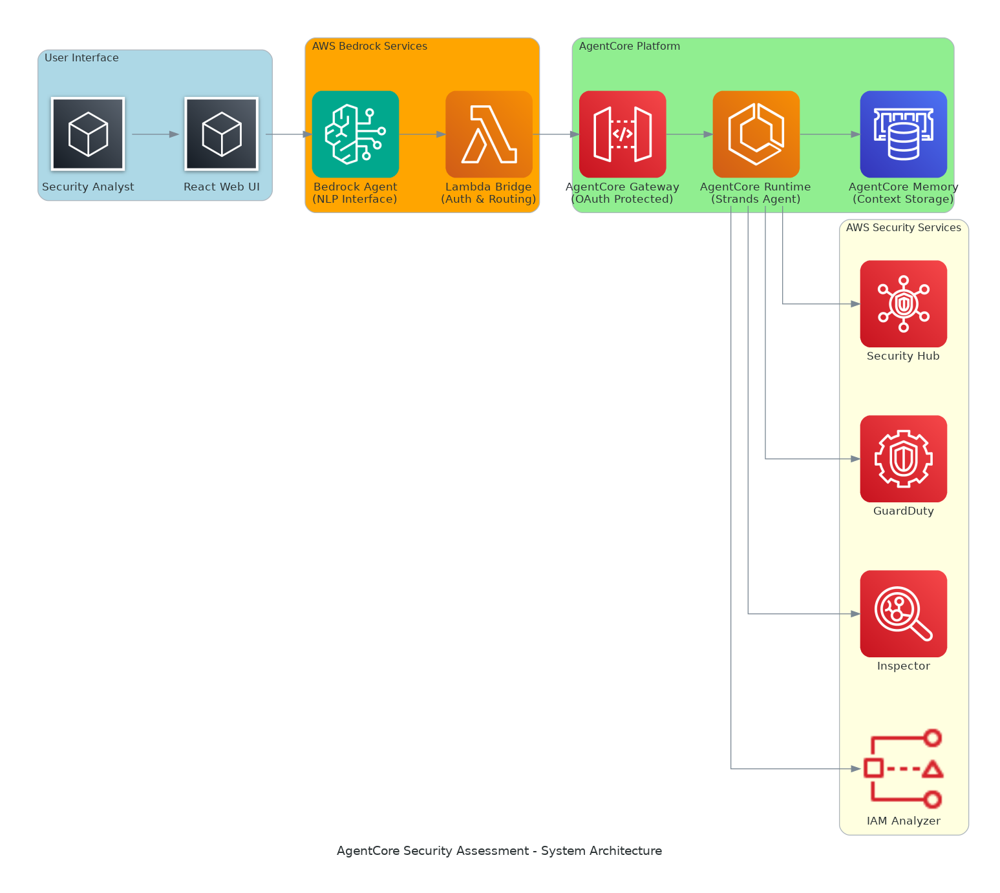
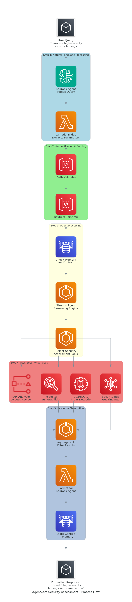

# Architecture Diagrams

## System Architecture

The system architecture shows the complete AgentCore Security Assessment platform with:

- **User Interface**: React web UI for security analysts
- **AWS Bedrock Services**: Natural language processing and Lambda bridge
- **AgentCore Platform**: OAuth-protected gateway, runtime, and persistent memory
- **AWS Security Services**: Integration with Security Hub, GuardDuty, Inspector, and IAM Access Analyzer

## Process Flow

The process flow demonstrates the end-to-end workflow:

1. **Natural Language Processing**: User query parsed by Bedrock Agent
2. **Authentication & Routing**: OAuth validation and request routing
3. **Agent Processing**: Memory context check, reasoning engine, and tool selection
4. **AWS Security Services**: Parallel API calls to security services
5. **Response Generation**: Data aggregation, formatting, and context storage

## Key Features

- **Natural Language Interface**: Ask security questions in plain English
- **OAuth Security**: Enterprise-grade authentication and authorization
- **Persistent Memory**: Context retention across conversation sessions
- **Multi-Service Integration**: Unified access to AWS security services
- **Real-time Processing**: Streaming responses with immediate feedback
