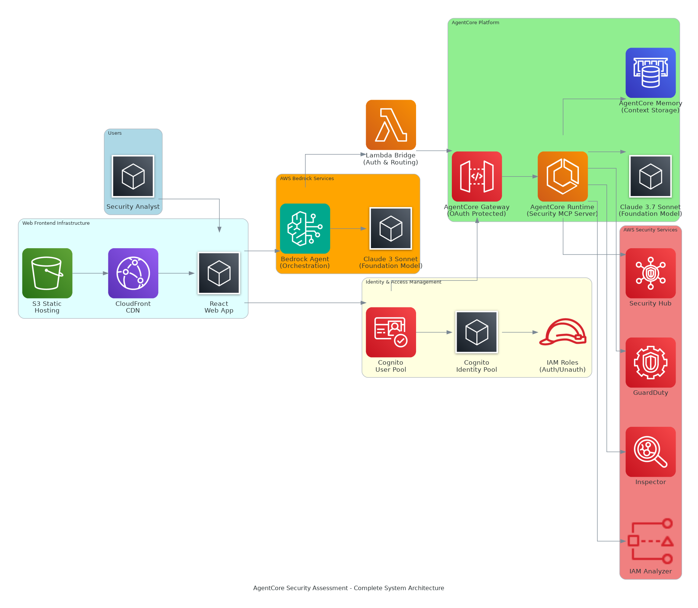
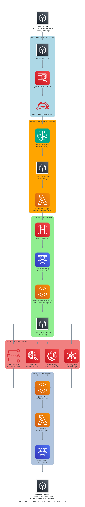

# Architecture Diagrams

## Complete System Architecture

The complete system architecture shows the enterprise-grade AgentCore Security Assessment platform with:

### **Web Frontend Infrastructure**
- **S3 Static Hosting**: Hosts React application assets
- **CloudFront CDN**: Global content delivery and caching
- **React Web App**: Modern, responsive security analyst interface

### **Identity & Access Management**
- **Cognito User Pool**: User authentication and management
- **Cognito Identity Pool**: Federated identity for AWS resource access
- **IAM Roles**: Authenticated and unauthenticated user permissions

### **AWS Bedrock Services**
- **Bedrock Agent**: Intelligent orchestration engine for natural language processing
- **Claude 3 Sonnet**: Foundation model powering the Bedrock Agent

### **Integration Layer**
- **Lambda Bridge**: Authentication handling and request routing (standalone component)

### **AgentCore Platform**
- **AgentCore Gateway**: OAuth-protected API gateway with Cognito integration
- **AgentCore Runtime**: Well-Architected Security MCP Server execution environment
- **Claude 3.7 Sonnet**: Advanced foundation model for security reasoning
- **AgentCore Memory**: Persistent context storage across sessions

### **AWS Security Services**
- **Security Hub**: Centralized security findings management
- **GuardDuty**: Intelligent threat detection
- **Inspector**: Vulnerability assessment
- **IAM Access Analyzer**: Access permissions analysis

## Complete Process Flow

The complete process flow demonstrates the enterprise-grade end-to-end workflow:

1. **Frontend & Authentication**: React UI → Cognito Authentication → IAM Token Generation
2. **Natural Language Processing**: Bedrock Agent → Claude 3 Sonnet Reasoning → Lambda Bridge Parameter Extraction
3. **AgentCore Processing**: OAuth Validation → Memory Context Check → Security MCP Server → Claude 3.7 Sonnet Processing
4. **AWS Security Services**: Parallel API calls to Security Hub, GuardDuty, Inspector, and IAM Access Analyzer
5. **Response Generation**: Data aggregation, Bedrock formatting, and context storage

## Key Enterprise Features

### **Security & Compliance**
- **Multi-layer Authentication**: Cognito User Pool + Identity Pool + IAM Roles
- **OAuth 2.0 Integration**: Enterprise-grade API security
- **Well-Architected Framework**: Security best practices implementation

### **Scalability & Performance**
- **CloudFront CDN**: Global content delivery with edge caching
- **AgentCore Runtime**: Serverless, auto-scaling execution environment
- **Memory Persistence**: Context retention across user sessions

### **AI & Intelligence**
- **Dual Foundation Models**: Claude 3 Sonnet (orchestration) + Claude 3.7 Sonnet (reasoning)
- **Natural Language Interface**: Ask security questions in plain English
- **Multi-Service Integration**: Unified access to AWS security services

### **Enterprise Architecture**
- **Microservices Design**: Loosely coupled, independently deployable components
- **Event-driven Processing**: Asynchronous security assessment workflows
- **Real-time Streaming**: Immediate feedback and progressive results

## Technical Implementation

- **Frontend**: React.js with AWS Amplify integration
- **Authentication**: Amazon Cognito with federated identity
- **API Layer**: AWS Lambda with Bedrock Agent integration
- **Runtime**: Amazon Bedrock AgentCore with MCP Server
- **Storage**: ElastiCache for memory, S3 for static assets
- **Security**: Multi-layer OAuth, IAM policies, and VPC isolation
