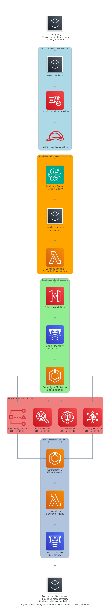

# Architecture Diagrams

## Final System Architecture

The corrected system architecture shows the accurate AgentCore Security Assessment platform with:

### **Web Frontend Infrastructure**
- **S3 Static Hosting**: Hosts React application assets
- **CloudFront CDN**: Global content delivery and caching
- **React Web App**: Modern, responsive security analyst interface

### **Identity & Access Management**
- **Cognito User Pool**: User authentication and management
- **Cognito Identity Pool**: Federated identity for AWS resource access
- **IAM Roles**: Authenticated and unauthenticated user permissions

### **AWS Bedrock Services**
- **Bedrock Agent**: Intelligent orchestration engine for natural language processing
- **Claude 3 Sonnet**: Foundation model powering the Bedrock Agent

### **Integration Layer**
- **Lambda Bridge**: Authentication handling and request routing (standalone component)

### **AgentCore Platform**
- **AgentCore Gateway**: OAuth-protected API gateway with Cognito integration
- **AgentCore Runtime**: Contains two distinct components:
  - **Agent (Claude 3.7 Sonnet)**: Handles reasoning and natural language understanding
  - **Security MCP Server**: Direct AWS API calls without LLM processing
- **AgentCore Memory**: Persistent context storage across sessions

### **AWS Security Services**
- **Security Hub**: Centralized security findings management
- **GuardDuty**: Intelligent threat detection
- **Inspector**: Vulnerability assessment
- **IAM Access Analyzer**: Access permissions analysis

## Final Process Flow

The corrected process flow demonstrates the accurate end-to-end workflow:

1. **Frontend & Authentication**: React UI → Cognito Authentication → IAM Token Generation
2. **Natural Language Processing**: Bedrock Agent → Claude 3 Sonnet Reasoning → Lambda Bridge Parameter Extraction
3. **AgentCore Processing**: OAuth Validation → Memory Context Check → Agent Reasoning (Claude 3.7 Sonnet) → Security MCP Tools Selection
4. **Direct AWS API Calls**: Security MCP Server makes direct API calls to AWS services (no LLM involved)
5. **Response Generation**: Data aggregation, Bedrock formatting, and context storage

## Key Technical Clarifications

### **AgentCore Runtime Architecture**
The AgentCore Runtime contains two distinct components:

1. **Agent with Claude 3.7 Sonnet**: 
   - Handles natural language understanding and reasoning
   - Processes user queries and determines which tools to use
   - Provides intelligent responses and recommendations

2. **Security MCP Server**: 
   - Contains security assessment tools (`check_security_services`, `get_security_findings`, etc.)
   - Makes **direct AWS API calls** to Security Hub, GuardDuty, Inspector, and IAM Access Analyzer
   - **No LLM processing** - pure API integration for data retrieval
   - Implements AWS Well-Architected Security Framework best practices

### **Data Flow Clarification**
- **User Query** → **Bedrock Agent (Claude 3 Sonnet)** → **Lambda Bridge** → **AgentCore Gateway**
- **AgentCore Gateway** → **Agent (Claude 3.7 Sonnet)** for reasoning and tool selection
- **Agent** → **Security MCP Server** for direct AWS API calls
- **Security MCP Server** → **AWS Security Services** (direct API calls, no LLM)
- **Results** → **Agent** → **Memory Storage** → **Response Formatting**

## Technical Implementation

- **Frontend**: React.js with AWS Amplify integration
- **Authentication**: Amazon Cognito with federated identity
- **API Layer**: AWS Lambda with Bedrock Agent integration
- **Runtime**: Amazon Bedrock AgentCore with MCP Server
- **Storage**: ElastiCache for memory, S3 for static assets
- **Security**: Multi-layer OAuth, IAM policies, and VPC isolation
