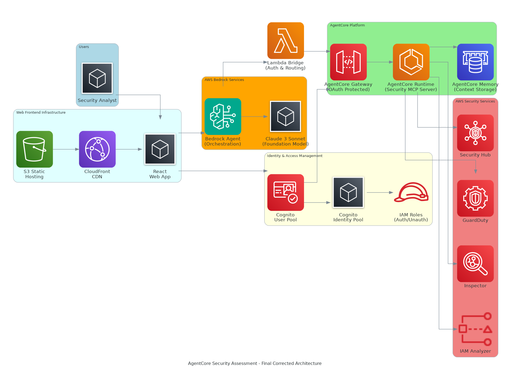

# AgentCore Security Assessment Application

A complete transformation of the AWS Well-Architected Security MCP server into a production-ready AgentCore application with Bedrock Agent integration.

## 🚀 **Live Demo**
**Deployed Application**: https://dwtz1c6gg4gdx.cloudfront.net/

*Experience the AI-powered security assessment platform in action!*

## 🏗️ System Architecture



### **Enterprise Components:**
- **Web Frontend**: S3 + CloudFront + React App
- **Identity Management**: Cognito User Pool + Identity Pool + IAM Roles
- **AI Processing**: Bedrock Agent (Claude 3 Sonnet) + Lambda Bridge
- **AgentCore Platform**: OAuth Gateway + Agent (Claude 3.7 Sonnet) + Security MCP Server
- **AWS Security Services**: Direct API integration with Security Hub, GuardDuty, Inspector, IAM Analyzer

## 🔄 Process Flow


### **Workflow:**
1. **Authentication**: React UI → Cognito → IAM Tokens
2. **NLP Processing**: Bedrock Agent → Claude 3 Sonnet → Lambda Bridge
3. **AgentCore**: OAuth Validation → Agent Reasoning → MCP Tools Selection
4. **Direct API Calls**: Security MCP Server → AWS Security Services (no LLM)
5. **Response**: Data aggregation → Formatting → Memory storage

## ✨ Key Features

### **🤖 AI-Powered Security Analysis**
- **Natural Language Interface**: Ask security questions in plain English
- **Dual AI Models**: Claude 3 Sonnet (orchestration) + Claude 3.7 Sonnet (reasoning)
- **Intelligent Tool Selection**: AI determines optimal security assessment approach

### **🔒 Enterprise Security**
- **Multi-layer Authentication**: Cognito User Pool + Identity Pool + IAM Roles
- **OAuth 2.0 Integration**: Enterprise-grade API security
- **Well-Architected Framework**: Security best practices implementation

### **⚡ High Performance**
- **Direct AWS API Calls**: Security MCP Server bypasses LLM for data retrieval
- **CloudFront CDN**: Global content delivery with edge caching
- **Memory Persistence**: Context retention across user sessions

### **🔧 Comprehensive Integration**
- **Multi-Service Support**: Security Hub, GuardDuty, Inspector, IAM Access Analyzer
- **Real-time Processing**: Streaming responses with immediate feedback
- **Scalable Architecture**: Serverless, auto-scaling execution environment

## 🚀 Quick Deployment

### Prerequisites
```bash
# Install required tools
pip install bedrock-agentcore-starter-toolkit
pip install strands-agents

# Configure AWS CLI
aws configure
export AWS_REGION=us-east-1
```

### Option 1: Automated Deployment (Recommended)
```bash
git clone https://github.com/ajitnk-lab/agentcore-security-assessment.git
cd agentcore-security-assessment
pip install -r requirements.txt

# Deploy all components automatically
cd deploy
python deploy_all.py
```

### Option 2: Manual Step-by-Step Deployment

#### Step 1: Deploy AgentCore Memory
```bash
cd memory
python setup_memory.py
# ✅ Output: Memory ID (save this)
```

#### Step 2: Deploy AgentCore Runtime  
```bash
cd ../runtime
agentcore configure -e security_agent.py
agentcore launch
# ✅ Output: Runtime ARN (save this)
```

#### Step 3: Deploy AgentCore Gateway
```bash
cd ../gateway
python deploy_gateway.py
# ✅ Output: Gateway URL and OAuth config (save these)
```

#### Step 4: Deploy Lambda Bridge
```bash
cd ../bedrock
python deploy_lambda.py
# ✅ Output: Lambda Function ARN (save this)
```

#### Step 5: Deploy Bedrock Agent
```bash
python deploy_agent_functions.py
# ✅ Output: Agent ID and Alias ID (save these)
```

#### Step 6: Test Deployment
```bash
cd ../test
python integration_test_final.py
# ✅ Expected: 100% success rate
```

## 🧪 Testing Your Deployment

### Test Natural Language Queries
```python
import boto3

bedrock_runtime = boto3.client('bedrock-agent-runtime', region_name='us-east-1')

# Replace with your actual Agent ID and Alias ID from deployment
response = bedrock_runtime.invoke_agent(
    agentId='YOUR_AGENT_ID',
    agentAliasId='YOUR_ALIAS_ID', 
    sessionId='test-session',
    inputText="Get high severity security findings from us-east-1 region, limit to 3"
)

# Process streaming response
for event in response['completion']:
    if 'chunk' in event and 'bytes' in event['chunk']:
        print(event['chunk']['bytes'].decode('utf-8'))
```

### Example Queries That Work
- "Check security services configuration for us-west-2 region"
- "Get medium severity security findings, limit to 5 results"  
- "Analyze security posture for EC2 service with recommendations"
- "List 1 security hub finding from us-east-1 region of high risk"

## 🔧 Configuration

After deployment, you'll have these key identifiers:

```bash
# From deployment outputs - save these values
MEMORY_ID="SecurityAssessment_XXXXXXX"
RUNTIME_ARN="arn:aws:bedrock-agentcore:us-east-1:ACCOUNT:runtime/security_agent-XXXXXXX"
GATEWAY_URL="https://XXXXXXX.gateway.bedrock-agentcore.us-east-1.amazonaws.com/mcp"
LAMBDA_ARN="arn:aws:lambda:us-east-1:ACCOUNT:function:security-agent-bridge"
AGENT_ID="XXXXXXXXXX"
ALIAS_ID="XXXXXXXXXX"
```

### Step 4: Deploy Bedrock Agent

```bash
cd ../bedrock
python deploy_lambda_bridge.py
python deploy_bedrock_agent.py
```

## Security Tools Available

The application provides comprehensive AWS security assessment capabilities:

### 🔍 **CheckSecurityServices**
- Monitor operational status of GuardDuty, Security Hub, Inspector, IAM Access Analyzer
- Identify service availability across regions
- Provide recommendations for maintaining security service coverage

### 🚨 **GetSecurityFindings**
- Collect security findings from Security Hub, GuardDuty, and Inspector
- Filter findings by severity (LOW, MEDIUM, HIGH, CRITICAL)
- Provide actionable remediation guidance

### 📊 **AnalyzeSecurityPosture**
- Comprehensive security assessment against AWS Well-Architected Framework
- Evaluate Identity & Access Management, Detective Controls, Infrastructure Protection
- Generate security scores and prioritized recommendations

### 🔎 **ExploreAwsResources**
- Discover resources across AWS services (EC2, S3, RDS, Lambda, IAM)
- Map resource relationships for security context
- Identify resources requiring security attention

### ✅ **GetResourceComplianceStatus**
- Check compliance against security standards
- Identify non-compliant resources
- Provide compliance metrics and improvement recommendations

## Usage Examples

### Direct Bedrock Agent Interaction

```python
import boto3

bedrock_runtime = boto3.client('bedrock-agent-runtime')

response = bedrock_runtime.invoke_agent(
    agentId='your-agent-id',
    agentAliasId='TSTALIASID',
    sessionId='security-assessment-session',
    inputText="Perform a comprehensive security assessment of my AWS account"
)
```

### Gateway Direct Access (with OAuth)

```python
import httpx
import asyncio

async def call_security_tool():
    # Get OAuth token
    token_response = await httpx.AsyncClient().post(
        'your-cognito-token-endpoint',
        data={
            'grant_type': 'client_credentials',
            'client_id': 'your-client-id',
            'client_secret': 'your-client-secret',
            'scope': 'your-scope'
        }
    )
    
    token = token_response.json()['access_token']
    
    # Call security tool
    response = await httpx.AsyncClient().post(
        'your-gateway-url',
        headers={'Authorization': f'Bearer {token}'},
        json={
            "jsonrpc": "2.0",
            "id": 1,
            "method": "tools/call",
            "params": {
                "name": "analyze_security_posture",
                "arguments": {}
            }
        }
    )
    
    return response.json()
```

## Project Structure

```
agentcore-security-app/
├── README.md                    # This file
├── requirements.txt             # Python dependencies
├── runtime/                     # AgentCore Runtime
│   ├── security_agent.py       # Main agent with security tools
│   ├── security_tools.py       # Core security assessment logic
│   └── requirements.txt        # Runtime-specific dependencies
├── memory/                      # AgentCore Memory
│   └── setup_memory.py         # Memory configuration script
├── gateway/                     # AgentCore Gateway
│   └── setup_gateway.py        # Gateway with OAuth setup
├── bedrock/                     # Bedrock Agent Integration
│   ├── deploy_bedrock_agent.py # Bedrock Agent deployment
│   ├── lambda_bridge.py        # Lambda bridge function
│   └── deploy_lambda_bridge.py # Lambda deployment script
├── deploy/                      # Deployment Scripts
│   └── deploy_all.py           # Automated deployment
└── test/                        # Integration Tests
    └── test_integration.py     # End-to-end testing
```

## Configuration Files

After deployment, you'll find these configuration files:

- `memory/.env` - Memory ID and region settings
- `gateway/gateway_config.json` - Gateway URL and OAuth credentials
- `bedrock/lambda_bridge_config.json` - Lambda function details
- `bedrock/bedrock_agent_config.json` - Bedrock Agent configuration

## Troubleshooting

### Common Issues

1. **Memory not found**: Ensure `BEDROCK_AGENTCORE_MEMORY_ID` is set correctly
2. **Gateway OAuth errors**: Check Cognito client credentials in configuration
3. **Lambda timeout**: Increase Lambda timeout if security assessments take longer
4. **Bedrock Agent permissions**: Ensure IAM roles have necessary permissions

### Debug Commands

```bash
# Check AgentCore Runtime status
agentcore status

# Test Gateway directly
cd test && python -c "import asyncio; asyncio.run(test_gateway_direct())"

# Check Lambda logs
aws logs tail /aws/lambda/your-lambda-function-name --follow
```

## Security Considerations

- **IAM Permissions**: Use least-privilege IAM roles for all components
- **OAuth Tokens**: Tokens are cached and automatically refreshed
- **Memory Encryption**: AgentCore Memory encrypts data at rest
- **Network Security**: Gateway uses HTTPS with OAuth 2.0 protection

## Cost Optimization

- **Memory Retention**: Security context retained for 90 days (configurable)
- **Lambda Concurrency**: Bridge function uses minimal resources
- **Runtime Scaling**: AgentCore Runtime scales automatically based on demand
- **API Calls**: Security tools are optimized to minimize AWS API calls

## Support

For issues and questions:
1. Check the integration tests: `python test/test_integration.py`
2. Review AWS CloudWatch logs for detailed error information
3. Ensure all environment variables are properly configured
4. Verify AWS permissions for all services

## 🙏 Credits & Acknowledgments

### **Original MCP Server**
This project is built upon and adapts the **AWS Well-Architected Security MCP Server** developed by AWS Labs:
- **Original Repository**: https://github.com/awslabs/mcp/tree/main/src/well-architected-security-mcp-server
- **License**: Apache License, Version 2.0
- **Credits**: AWS Labs team for creating the foundational security assessment tools

### **Transformation & Enhancement**
We transformed the original MCP server into a production-ready AgentCore application by:
- **AgentCore Integration**: Hosting as a Bedrock AgentCore application with enterprise features
- **Natural Language Interface**: Adding Bedrock Agent for conversational security assessment
- **Enterprise Architecture**: Implementing OAuth, memory persistence, and scalable deployment
- **Web Frontend**: Creating a React-based user interface with CloudFront distribution
- **Multi-layer Authentication**: Adding Cognito User Pool and Identity Pool integration

### **AWS Services Used**
- Amazon Bedrock AgentCore (Runtime, Memory, Gateway)
- Amazon Bedrock Agent with Claude 3 Sonnet
- AWS Lambda for bridge functionality
- Amazon Cognito for authentication
- Amazon S3 and CloudFront for web hosting
- AWS Security Hub, GuardDuty, Inspector, IAM Access Analyzer

**Special thanks to the AWS Labs team for providing the excellent foundation that made this enterprise-grade security assessment platform possible.**

## 📄 License

This project is licensed under the Apache License, Version 2.0 - same as the original AWS Well-Architected Security MCP Server.
